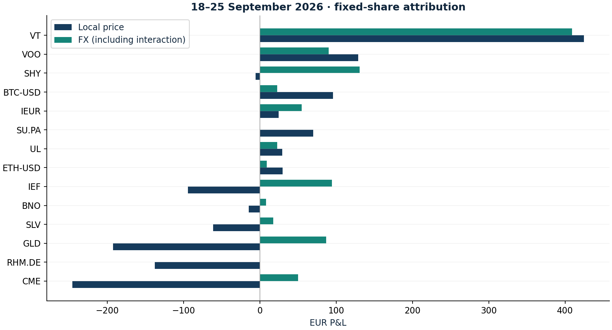

# Price and currency attribution

Research authored 2026-09-28 · Exact accounting identity

## Question

Did the first forward week's profit come from assets or currency?

## Computed finding

18–25 September: €52.27 local-price P&L plus €996.95 currency P&L equals €1,049.21.



## Method

Hold share quantities fixed from 18 to 25 September 2026. Decompose EUR P&L exactly into local-price change translated at opening FX and currency change applied to the closing local value. Assign the interaction explicitly to FX.

## Investment implication

Unhedged US Treasury and commodity ETF marks can move in EUR even when local prices barely move. Attribute the result before judging the thesis.

## What could invalidate the interpretation

A change in units, distribution entitlement or other cash flow invalidates this two-endpoint fixed-position calculation and requires a daily ledger.

## Next research step

Extend to daily transaction-aware attribution and an explicit, costed currency-hedging counterfactual.

## Discussion prompt

Derive the price/FX cross term. Explain why a USD-listed global equity ETF does not represent pure economic USD exposure.

## Limitations

Quotation-currency exposure is not underlying economic currency exposure; VT and ADRs contain other currencies.

## Reproduce

```bash
python -m investment_lab attribution
```

Full numerical output: [attribution.json](attribution.json). CSV tables use decimal returns, not percentages.

## Sources and use

- [Frozen portfolio and Yahoo Finance price archives](https://fabio-investment-lab.fraccafabio.chatgpt.site/#method): Accounting inputs and reference closing marks. Retrieved in 2026, not historical point-in-time vintages.
