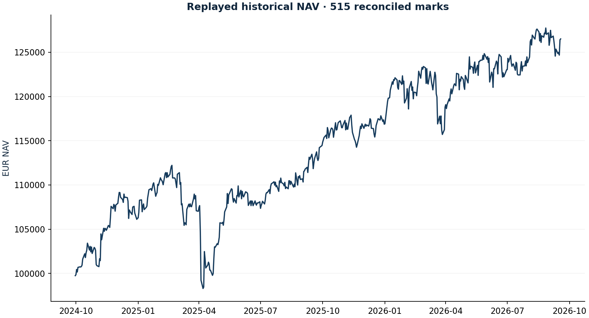

# Portfolio accounting audit

Research authored 28 September 2026 · Frozen-data reconciliation

## Question

Can every euro of the published portfolio be reconciled?

## Computed finding

All 515 historical NAV marks reconcile. Replayed NAV: €126,505.91; current marks: €127,555.12. Pending order excluded.



## Method

Replay all 217 signed instrument transactions against frozen EUR-adjusted prices. Recompute fees and cash, reconcile every historical NAV, convert index units to closing share equivalents and independently value the current book. Verify evidence dates and exclude pending instructions.

## Investment implication

A risk or performance claim is unusable until cash, positions and P&L agree. The audit supplies the common accounting base for all other projects.

## What could invalidate the interpretation

Any unexplained NAV difference, future-dated source, stale quote or unprocessed corporate action blocks publication.

## Next research step

Extend the forward ledger to explicit ex-date entitlements, payment dates, tax and interest when those events actually occur.

## Discussion prompt

Explain adjusted index units versus real shares, why price plus dividends must not be counted twice, and why an order is not a fill.

## Limitations

Replay validates accounting, not historical authorship or achievable fills. No tax; zero cash interest.

## Reproduce

```bash
python -m investment_lab audit
```

Full numerical output: [audit.json](audit.json). CSV tables use decimal returns, not percentages.

## Sources and use

- [Frozen portfolio and Yahoo Finance price archives](https://fabio-investment-lab.fraccafabio.chatgpt.site/#method): Accounting inputs and reference closing marks. Retrieved in 2026, not historical point-in-time vintages.
