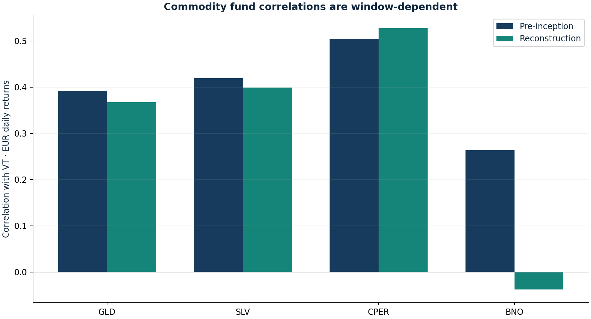

# Commodity exposure and futures mechanics

Research authored 2026-09-28 · Fund data + synthetic curves

## Question

What risk is owned through gold, silver, copper and oil vehicles?

## Computed finding

With unchanged spot and an identically resetting 2% contango curve, the illustrative collateralised futures return is -19.69% over twelve months. This is a mechanics example, not a forecast.



## Method

Compare EUR return correlations and volatility of VT, GLD, SLV, CPER and BNO in two windows. Independently illustrate long-futures convergence in backwardation, a flat curve and contango with unchanged spot and explicit collateral/cost assumptions.

## Investment implication

Separate physical-metal exposure from futures-based funds. Spot direction alone cannot explain an oil or copper fund's return; diversified-index research does not validate a concentrated commodity bet.

## What could invalidate the interpretation

Observed diversification can disappear in a new regime. A futures curve, index roll rule or financing convention different from the illustration changes the result.

## Next research step

Archive contract-level settlements, expiry schedules, roll rules and collateral yields to decompose actual fund returns.

## Discussion prompt

Explain why contango need not cause an instantaneous cash loss on the roll date, and why neither gold nor silver is a guaranteed short-horizon inflation hedge.

## Limitations

Fund returns include their particular structure and costs; no claim to replicate diversified commodity-futures academic indices. Synthetic curves reset identically each month with unchanged spot, 3% collateral and 10 bp monthly cost; these are not forecasts or actual CPER/BNO returns.

## Reproduce

```bash
python -m investment_lab commodities
```

Full numerical output: [commodities.json](commodities.json). CSV tables use decimal returns, not percentages.

## Sources and use

- [Gorton & Rouwenhorst — Facts and Fantasies about Commodity Futures (2004)](https://www.nber.org/papers/w10595): Research on diversified, collateralised futures; not a direct validation of GLD, CPER or BNO.
- [Erb & Harvey — The Golden Dilemma (2013)](https://www.nber.org/papers/w18706): Cautions against treating gold as a reliable short-horizon inflation hedge.
