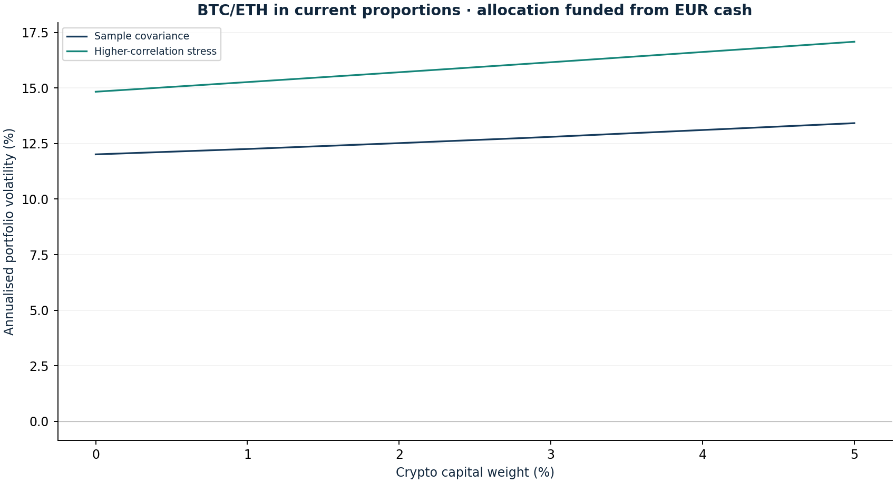

# Crypto allocation and correlation stress

Research authored 2026-10-03 · Cash-funded sizing sensitivity

## Question

How much risk can a small Bitcoin/Ether allocation consume?

## Computed finding

The frozen 2.8% crypto capital allocation contributes 6.4% of sample portfolio variance. Cash-funded alternatives are compared without selecting the best historical return.



## Input dates and assumptions

- Other current weights held fixed; changes to crypto are financed from zero-return cash.
- Stress correlation = 50% sample + 50% all-ones matrix; historical marginal volatilities unchanged. This is an assumed co-movement shock.
- Common-session risk estimates exclude most crypto weekend moves. Separate coverage audit reports whether weekend pairs exist.

## Method

Hold the other current weights fixed and fund 0–5% crypto allocations from EUR cash in the existing BTC/ETH proportion. Show Euler variance shares and an explicitly positive-semidefinite correlation stress. Audit whether weekend price pairs are actually present.

## Investment implication

Set crypto exposure by its impact on total portfolio risk and liquidity, not only by its small capital weight.

## What could invalidate the interpretation

The common-market calendar omits weekend moves; past covariance excludes custody losses and may understate deleveraging.

## Next research step

Acquire a complete daily crypto archive and document custody, venue and gap scenarios before increasing the paper allocation.

## Discussion prompt

Explain why capital weight and variance share differ and why an arbitrary shocked correlation matrix may be invalid.

## Limitations

Historical covariance can understate simultaneous deleveraging, exchange failure and weekend gaps. A USD spot proxy omits custody, funding, exchange, staking and slippage risks. Higher correlation alone is not a full crisis scenario. Historical constant-weight performance is not a proposed trade or evidence that a crypto weight is optimal.

## Reproduce

```bash
python -m investment_lab crypto-budget
```

Full numerical output: [crypto-budget.json](crypto-budget.json). CSV tables use decimal returns, not percentages.

## Sources and use

- [Liu & Tsyvinski — Risks and Returns of Cryptocurrency (2018)](https://www.nber.org/papers/w24877): Motivates separate crypto risk treatment; an early sample does not establish stable modern correlations.
- [Frozen portfolio and Yahoo Finance price archives](https://fabio-investment-lab.fraccafabio.chatgpt.site/#method): Accounting inputs and reference closing marks. Retrieved in 2026, not historical point-in-time vintages.
