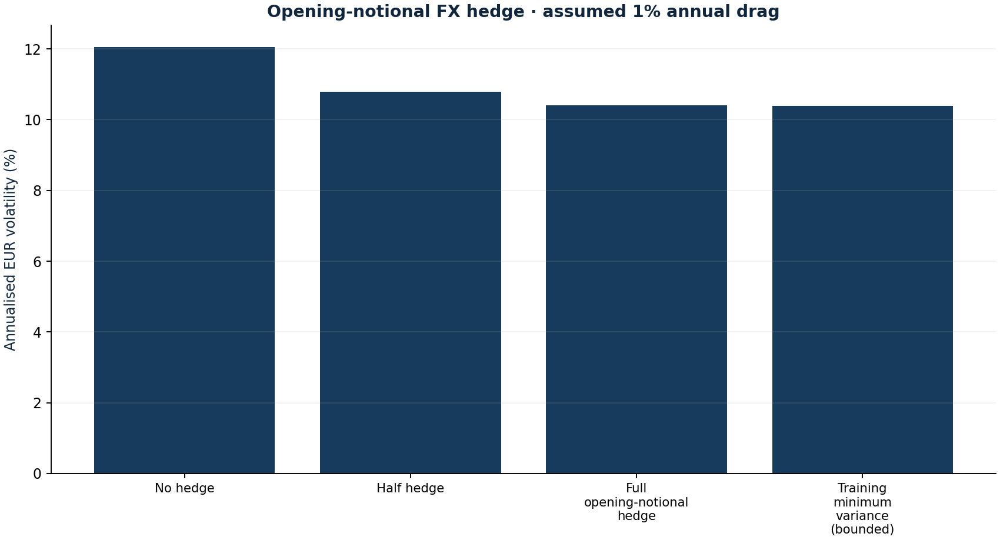

# EUR currency hedge frontier

Research authored 2026-10-03 · Historical proxy sensitivity

## Question

How sensitive is portfolio risk to partial currency hedging and its cost?

## Computed finding

USD-listed positions are 88.5% of NAV. A training-window minimum-variance translation hedge is 98.8% before the 0–100% bound; this is not an economic currency look-through.



## Input dates and assumptions

- Current 25 September weights applied to past returns; hypothetical daily constant weights.
- Hedge payoff is -h × starting USD-listed weight × change in EUR per USD.
- 0%, 1% and 3% annual drag are sensitivity assumptions, not observed forward points. No dollar cash position exists in the base book.

## Method

Compare zero, half, full and estimated minimum-variance hedging of opening USD-listed notional. Estimate the hedge coefficient using observations through 27 September 2024; evaluate later observations with three assumed annual carry drags. Current weights make this a retrospective exposure experiment.

## Investment implication

Separate currency protection from expected carry. Compare risk reduction with a cost hurdle before acquiring an actual forward.

## What could invalidate the interpretation

Quotation currency is not economic exposure. Daily reset assumptions, proxy basis and changing covariance may make a calculated hedge inappropriate.

## Next research step

Archive executable EUR/USD forward points and fund look-through before documenting a prospective hedge policy.

## Discussion prompt

Derive Cov(portfolio, hedge-leg)/Var(hedge-leg). Why is hedging every USD-listed ETF potentially an overhedge?

## Limitations

This is a translation counterfactual, not a funded forward strategy. The hedge covers opening dollar notional, leaving asset-return × FX interaction. Daily resetting, margin, basis and executable spreads are omitted. VT, IEUR, ADRs and commodities have economic exposures different from their listing currency; a universal USD hedge can introduce new risk.

## Reproduce

```bash
python -m investment_lab currency
```

Full numerical output: [currency.json](currency.json). CSV tables use decimal returns, not percentages.

## Sources and use

- [Borio et al. — Covered Interest Parity Lost (BIS, 2016)](https://www.bis.org/publ/qtrpdf/r_qt1609e.htm): Explains why actual forward quotes can differ from frictionless parity; basis is not estimated here.
- [Frozen portfolio and Yahoo Finance price archives](https://fabio-investment-lab.fraccafabio.chatgpt.site/#method): Accounting inputs and reference closing marks. Retrieved in 2026, not historical point-in-time vintages.
