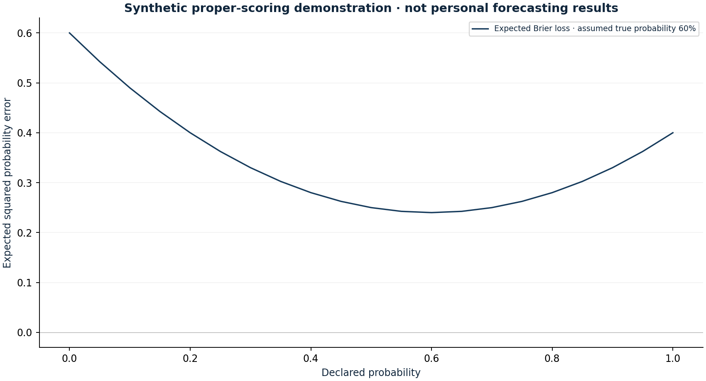

# Prospective thesis and probability register

Research authored 2026-10-03 · Prospective infrastructure; zero forecasts

## Question

How can future investment judgements become auditable evidence?

## Computed finding

0 prospective forecasts and 0 resolved outcomes are registered. No forecasting skill score is claimed. The probability-scoring chart is a labelled mathematical demonstration.



## Input dates and assumptions

- Register starts empty on 3 October 2026. Do not backfill historical probabilities.
- Forecasts require a dated cutoff, explicit binary outcome, source, alternative, invalidation condition and deadline; resolutions append a separate evidence-backed record.
- Binary Brier score = (probability − outcome)². Lower is better; compare to a preregistered base-rate benchmark before making skill claims.

## Method

Validate append-only forecasts and resolutions with timestamped information cutoffs, explicit outcome rules and a SHA-256 chain. Compute binary Brier scores only for resolved registered forecasts. The empty initial register is separate from a synthetic proper-scoring demonstration.

## Investment implication

Record probabilities, alternatives and invalidation rules before events. Preserve mistakes and unresolved outcomes; connect any later trade to the original thesis.

## What could invalidate the interpretation

A rewritten hash chain, selective resolution or vague event definition destroys evidential value. A Git timestamp alone does not verify source availability.

## Next research step

Enter the first owner-approved forecast with scripts/record_decision.py and publish its commit before the outcome; retain an external timestamp anchor.

## Discussion prompt

Why does a proper scoring rule encourage honest probabilities, and why is a low score meaningless without a base-rate benchmark?

## Limitations

A hash chain detects internal tampering, but the entire chain can be rewritten. External Git commit timestamps and public pre-event publication are necessary anchors, not independent audits. Honest entry dates and resolution evidence still require human review. Small or selectively resolved samples cannot establish calibration or investment skill. This register does not record trades or place orders.

## Reproduce

```bash
python -m investment_lab decision-log
```

Full numerical output: [decision-log.json](decision-log.json). CSV tables use decimal returns, not percentages.

## Sources and use

- [Gneiting & Raftery (2007), Strictly Proper Scoring Rules, Prediction, and Estimation](https://doi.org/10.1198/016214506000001437): Motivates recording probabilities before outcomes and scoring with binary Brier loss. A theoretical demonstration is kept separate from personal evidence.
