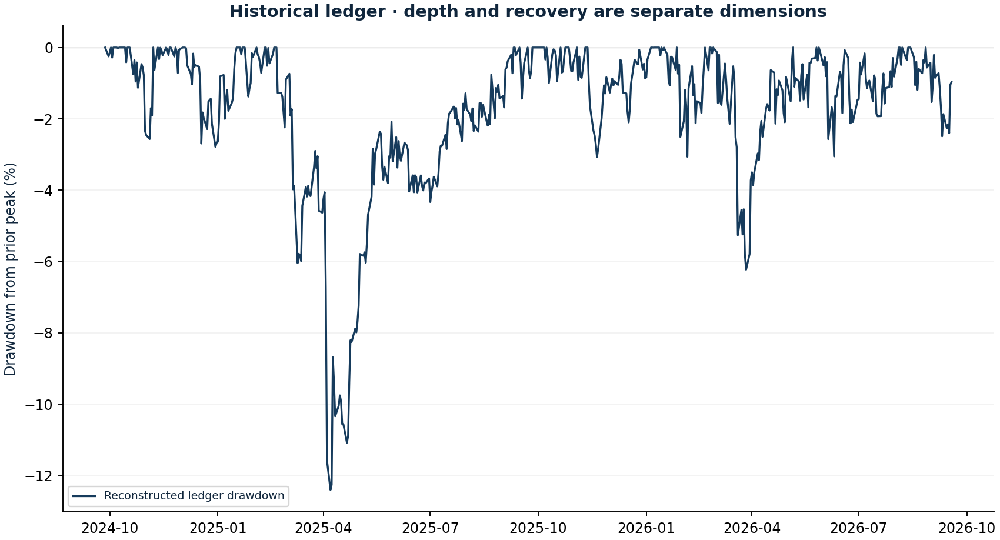

# Drawdown and recovery anatomy

Research authored 2026-10-03 · Path-risk diagnostic

## Question

How deep and how long were losses, and how path-dependent is that result?

## Computed finding

The reconstructed ledger’s deepest drawdown was -12.4%. Its episode lasted 144 recorded sessions; recovery status and dates are retained. Resampling current weights is a separate risk experiment.



## Input dates and assumptions

- Ledger starts with EUR 100,000 before initial fees; episode recovery requires matching or exceeding the prior peak.
- Bootstrap uses current weights applied to the 2021–2026 archive, zero cash return and hypothetical daily constant weights.
- 600 circular block samples at lengths 1, 5 and 20; 252-session paths. The 5th percentile is the more adverse tail.

## Method

Extract peak–trough–recovery episodes from the reconstructed NAV, including unrecovered episodes. Separately resample the current-weight return proxy into 600 one-year paths at block lengths 1, 5 and 20; retain the full sensitivity rather than selecting a favourable block.

## Investment implication

Discuss both capital loss and time underwater. The drawdown tolerated by an investor may differ from a one-day VaR budget.

## What could invalidate the interpretation

Resampling cannot create unseen crises. Current weights and stationary historical blocks may be poor approximations to future regimes.

## Next research step

Extend history across distinct crises and compare explicit liquidity stresses with prospective risk limits.

## Discussion prompt

Why is maximum drawdown not a one-day risk statistic? What information is lost when returns are randomly reordered?

## Limitations

Observed drawdown is not a maximum possible loss. Resampling reuses a short sample and cannot invent unseen crises; frequencies are conditional simulation results, not calibrated future probabilities. Current-weight simulation and the historical discretionary ledger are different portfolios. No drawdown optimisation or replication of the cited paper.

## Reproduce

```bash
python -m investment_lab drawdowns
```

Full numerical output: [drawdowns.json](drawdowns.json). CSV tables use decimal returns, not percentages.

## Sources and use

- [Chekhlov, Uryasev & Zabarankin (2005), Drawdown Measure in Portfolio Optimization](https://researchconnect.stonybrook.edu/en/publications/drawdown-measure-in-portfolio-optimization/): Motivates path-dependent loss analysis. The project measures episodes and block-resampling sensitivity; it does not solve the paper’s optimisation problem.
- [Frozen portfolio and Yahoo Finance price archives](https://fabio-investment-lab.fraccafabio.chatgpt.site/#method): Accounting inputs and reference closing marks. Retrieved in 2026, not historical point-in-time vintages.
