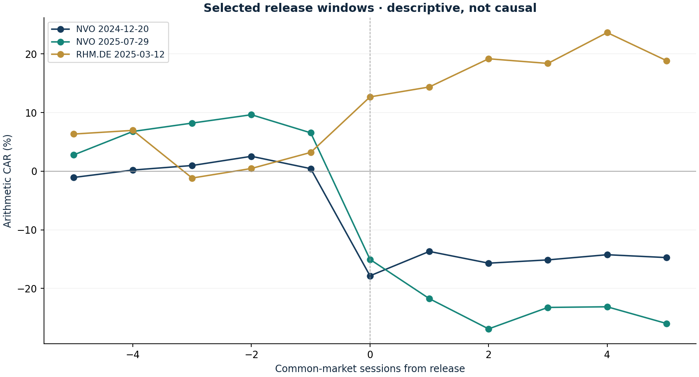

# Novo and Rheinmetall event studies

Research authored 28 September 2026 · Descriptive retrospective study

## Question

How unusual were the price moves around the thesis-changing releases?

## Computed finding

NVO 2024-12-20: -18.28% event-day abnormal return; NVO 2025-07-29: -21.59% event-day abnormal return; RHM.DE 2025-03-12: 9.47% event-day abnormal return. Selected events do not establish causality.



## Method

Fit a simple EUR market model on sessions -120 through -21 before each release, then measure abnormal returns over -5 through +5. Use VT for the Novo ADR and IEUR for Rheinmetall. Bridge adjusted-price archives at the overlapping date before combining them.

## Investment implication

Distinguish a stock-specific repricing from a broad market move. Preserve unfavourable outcomes and connect fundamental releases to a repeatable diagnostic.

## What could invalidate the interpretation

A different benchmark, concurrent news or non-synchronous prices can materially change abnormal returns. Event selection after the outcome prevents a causal or predictive claim.

## Next research step

Pre-register future events and windows, include unaffected controls and sector factors, and separate announcement time from local close time.

## Discussion prompt

Explain alpha and beta estimation, arithmetic CAR versus compounded wealth, event contamination and why three selected events do not establish skill.

## Limitations

Three events selected after observing outcomes; descriptive, not causal inference or strategy validation. Concurrent news, EUR translation and asynchronous Europe/US closes matter. No significance claim, multiple-testing adjustment or sector-factor model.

## Reproduce

```bash
python -m investment_lab events
```

Full numerical output: [events.json](events.json). CSV tables use decimal returns, not percentages.

## Sources and use

- [MacKinlay — Event Studies in Economics and Finance (1997)](https://www.jstor.org/stable/2729691): Market-model abnormal-return framework. No significance claim or causal identification is made here.
- [Novo Nordisk REDEFINE 1 headline results](https://www.novonordisk.com/news-and-media/news-and-ir-materials/news-details.html?id=915082): Primary dated release for the historical event.
- [Novo Nordisk revised 2025 outlook](https://www.novonordisk.com/news-and-media/news-and-ir-materials/news-details.html?id=916407): Primary dated release for the historical event.
- [Rheinmetall FY2024 results and 2025 outlook](https://www.rheinmetall.com/en/media/news-watch/news/2025/03/2025-03-12-rheinmetall-financial-figures-fiscal-year-2024): Primary dated release for the historical event.
