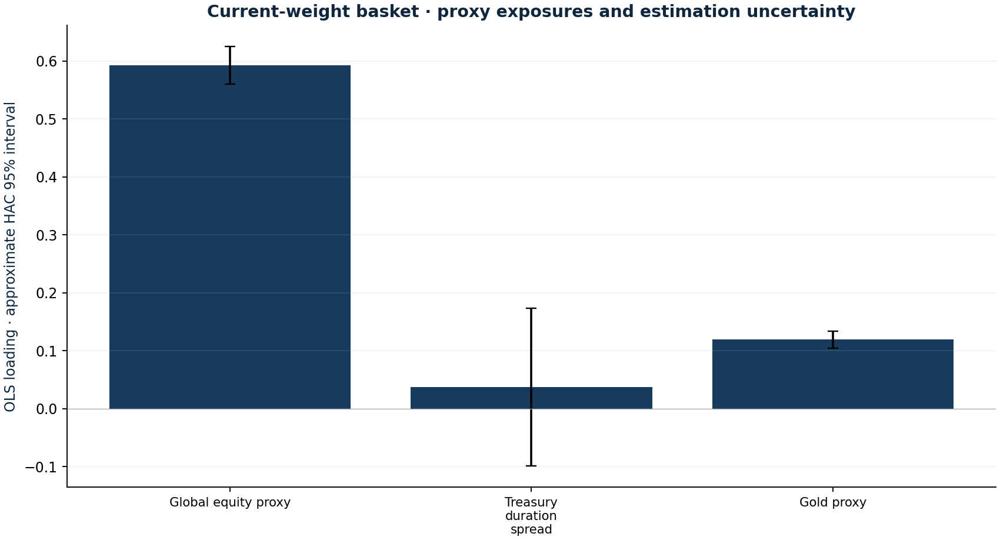

# Factor exposure and model fragility

Research authored 2026-10-03 · Descriptive regression

## Question

How much of the basket is explained by equity, duration and gold proxies?

## Computed finding

Three tradable proxies explain 92.8% of the fixed-weight basket's daily variation over the last 252 common sessions. Explanatory fit is not causality or alpha.



## Input dates and assumptions

- Current weights: 25 September 2026. Empirical sample ends 18 September 2026.
- EUR adjusted returns; VT, IEF minus SHY, and GLD. Intercept is a daily statistical residual, not risk-free-adjusted alpha.
- OLS includes intercept; Bartlett HAC covariance uses five lags. PCA describes the three standardised proxy factors.

## Method

Regress the fixed current-weight EUR basket on VT, IEF minus SHY, and GLD. Compare pre-inception and recent 252-session windows. Show Newey–West uncertainty, residual volatility, correlation conditioning and first principal-component share.

## Investment implication

Identify broad drivers and exposure instability. Large R-squared can be mechanical because regressors are also portfolio holdings.

## What could invalidate the interpretation

Omitted factors, overlap, collinearity and shifting coefficients undermine interpretation. The intercept is not a risk-free-adjusted alpha estimate.

## Next research step

Use non-overlapping, investable factors, explicit EUR cash returns and rolling out-of-sample attribution.

## Discussion prompt

Distinguish statistical fit, investable factor returns and causal explanation; explain why HAC errors do not cure misspecification.

## Limitations

Factors contain assets already in the basket, making some fit mechanical. Correlated proxies, omitted factors and asynchronous closes complicate interpretation. HAC intervals are approximate and not multiple-testing adjusted. These are not Fama–French factors, a macro causal model, or a forward return forecast.

## Reproduce

```bash
python -m investment_lab factors
```

Full numerical output: [factors.json](factors.json). CSV tables use decimal returns, not percentages.

## Sources and use

- [Newey & West (1986/1987), A Simple, Positive Semi-Definite, Heteroskedasticity and Autocorrelation Consistent Covariance Matrix](https://www.nber.org/papers/t0055): OLS coefficient uncertainty uses a Bartlett-weighted HAC estimator with five lags. Approximate intervals do not establish causal exposures.
- [Frozen portfolio and Yahoo Finance price archives](https://fabio-investment-lab.fraccafabio.chatgpt.site/#method): Accounting inputs and reference closing marks. Retrieved in 2026, not historical point-in-time vintages.
