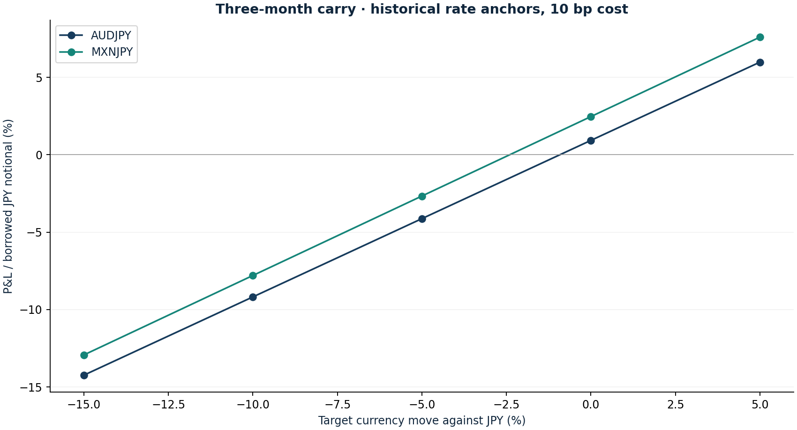

# Carry, break-even and funding stress

Research authored 28 September 2026 · Mechanics + observed spot risk

## Question

How little adverse currency movement can erase the carry?

## Computed finding

Illustrative quarterly carry is erased by spot losses of 0.92% for AUD/JPY and 2.40% for MXN/JPY. Neither is a funded portfolio trade.



## Method

Calculate financed AUD/JPY and MXN/JPY payoffs with simple deposit/loan interest, 10 bp assumed total cost and September-2024 policy-rate anchors. Derive break-even spot moves and textbook zero-basis forward ratios. Measure historical spot-only tail risk and pair correlation separately.

## Investment implication

Two target currencies funded in yen share a common vulnerability. A small quarterly accrual should be compared with a large adverse spot move before allocating capital.

## What could invalidate the interpretation

Actual forwards, funding spreads, margin calls and collateral remuneration can overturn the indicative return. Without those records, this overlay contributes zero reported portfolio P&L.

## Next research step

Archive executable forward points and bid/ask quotes, define collateral and financing, then start a prospective EUR-valued paper ledger.

## Discussion prompt

Distinguish return on borrowed notional from return on margin, covered parity from uncovered expected return, and a spot series from a carry total-return series.

## Limitations

Hypothetical simple-interest deposits; no forward points, cross-currency basis, margin path, broker financing, or EUR conversion. Spot risk is not total carry P&L. Both pairs share JPY funding.

## Reproduce

```bash
python -m investment_lab fx
```

Full numerical output: [fx.json](fx.json). CSV tables use decimal returns, not percentages.

## Sources and use

- [Brunnermeier, Nagel & Pedersen — Carry Trades and Currency Crashes (2008)](https://markus.scholar.princeton.edu/publications/carry-trades-and-currency-crashes): Funding unwind and downside-tail motivation; the project does not reproduce their currency basket study.
- [Borio et al. — Covered Interest Parity Lost (BIS, 2016)](https://www.bis.org/publ/qtrpdf/r_qt1609e.htm): Explains why actual forward quotes can differ from frictionless parity; basis is not estimated here.
- [September-2024 central-bank rate anchors](https://www.rba.gov.au/media-releases/2024/mr-24-18.html): AUD 4.35%, JPY 0.25%, MXN 10.50% are historical policy anchors, not executable matched-maturity lending or borrowing quotes. See docs/SOURCES.md for the BOJ and Banxico releases.
