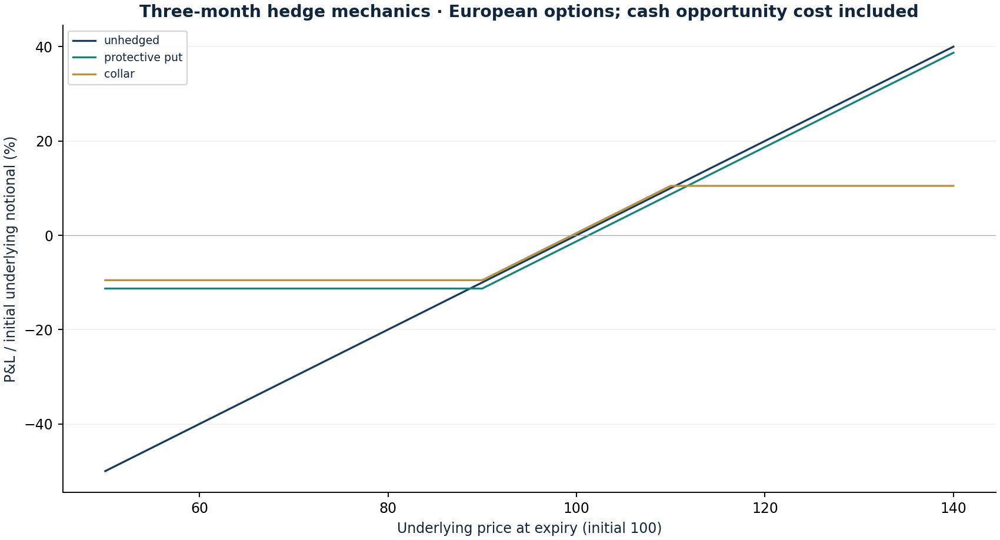

# Protective puts and collar economics

Research authored 2026-10-03 · Synthetic option mechanics

## Question

What is the actual trade-off between downside protection, premium and foregone upside?

## Computed finding

At 25% assumed volatility, the 90-strike put costs 1.18 per 100 of underlying. The collar exchanges upside above 110 for call premium; neither structure is costless.



## Input dates and assumptions

- Synthetic underlying 100; European put strike 90 and call strike 110; maturity 0.25 years; continuous rate 3%; dividend yield zero.
- Black–Scholes volatility assumptions 15%, 25%, 40%; no live option quotes. Each option leg costs 0.10 per 100 notional.
- Premiums and fees are accrued at the assumed cash rate. P&L is incremental to cash opportunity cost, per underlying notional, not return on premium or margin.

## Method

Price synthetic three-month European options using Black–Scholes. Compare an unhedged underlying, a 90-strike protective put and a 90/110 collar. Include premium cash opportunity cost and per-leg fees; compare 15%, 25%, 40% assumed volatility.

## Investment implication

State the loss floor, upside cap and funding cost explicitly before calling a hedge attractive. These payoffs do not establish that insurance is cheap.

## What could invalidate the interpretation

Real implied skew, bid/ask costs, dividends, American exercise and basis risk can materially change the trade.

## Next research step

Source a dated option chain and contract specifications; write a cash-funded prospective hedge thesis before any paper fill.

## Discussion prompt

Derive put–call parity and explain why P&L divided by underlying notional is not return on option premium.

## Limitations

No options are held in the portfolio. Constant volatility and European exercise ignore smile, skew, jumps and early assignment. A real ETF hedge requires dividends, multipliers, expiry, liquidity, cash and tax records; an index proxy introduces basis risk. Expiry floors do not describe interim mark-to-market or liquidation risk.

## Reproduce

```bash
python -m investment_lab option-hedges
```

Full numerical output: [option-hedges.json](option-hedges.json). CSV tables use decimal returns, not percentages.

## Sources and use

- [Black & Scholes (1973), The Pricing of Options and Corporate Liabilities](https://doi.org/10.1086/260062): European call/put pricing at assumed constant volatility, with put–call parity tested. No market-implied volatility or tradable quote is inferred.
- [Cboe (2021), Hedging Downside Exposure with PPUT, CLL and CLLZ Indices](https://www.cboe.com/insights/posts/benchmark-indices-series-hedging-downside-exposure-with-pput-cll-and-cllz-indices/): Institutional context for protective puts and collars. Synthetic strikes and costs do not replicate a Cboe benchmark.
