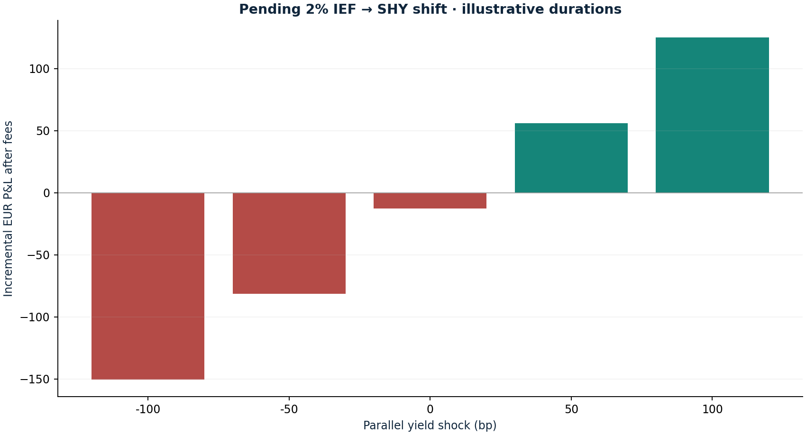

# Duration, convexity and curve risk

Research authored 28 September 2026 · Illustrative scenario model

## Question

What does the proposed IEF-to-SHY shift actually change?

## Computed finding

The pending 2% shift reduces assumed portfolio duration by 0.108 years. Two-leg costs are €12.76; a parallel yield rise of 9.3 bp covers them in the instantaneous approximation.



## Method

Price synthetic 2- and 8-year semiannual coupon bonds exactly. Compare duration-convexity approximations, node shocks and non-parallel curve scenarios. Then evaluate a 2%-of-NAV shift using explicitly assumed ETF durations of 7.2 and 1.8 years, including both trading fees.

## Investment implication

The shift modestly lowers sensitivity to a yield rise while giving up gains if yields fall. The fee hurdle makes the size of the intended risk reduction concrete.

## What could invalidate the interpretation

The interpretation fails if ETF duration, cash availability or the curve differ materially from assumptions. A Fed decision alone cannot identify an underpriced long-bond risk premium.

## Next research step

Replace teaching inputs with dated fund analytics and a sourced Treasury curve before execution; model FX hedging separately.

## Discussion prompt

Explain why policy rates and long yields can move differently, and why dollar duration does not include EUR/USD risk.

## Limitations

Instantaneous USD price shocks only: no coupon carry, roll-down, tax, FX or ETF reconstitution. All yields and ETF durations are illustrative. Pending shift remains unfilled.

## Reproduce

```bash
python -m investment_lab rates
```

Full numerical output: [rates.json](rates.json). CSV tables use decimal returns, not percentages.

## Sources and use

- [Adrian, Crump & Moench — Pricing the Term Structure with Linear Regressions](https://www.newyorkfed.org/research/staff_reports/sr340.html): Conceptual distinction between expected short rates and term compensation. No ACM model is fitted in this project.
