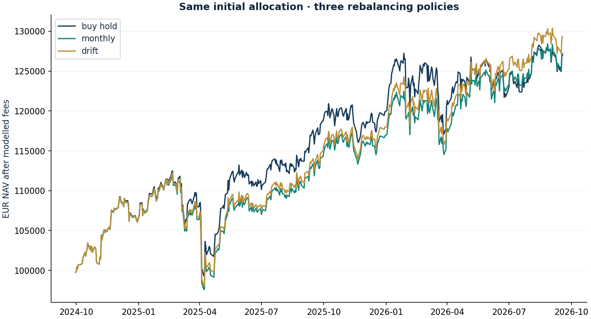

# Is more trading actually better?

Research authored 2026-09-28 · Retrospective rule comparison

## Question

How do buy-and-hold, monthly resets and drift bands compare?

## Computed finding

Buy hold: 26.99% net, €248 fees; Monthly: 27.20% net, €468 fees; Drift: 29.35% net, €394 fees. These are historical comparisons, not verified alpha.



## Method

Keep the same 16-instrument September-2024 allocation for all three rules. Review at the last calendar weekday and execute at a strictly later common-market close. Charge 25 bp per side and 50 bp for crypto, then vary costs without selecting the best-performing configuration.

## Investment implication

Separate allocation maintenance from new investment information. Additional activity should be justified by risk control or improved expected returns, not by making the journal look busy.

## What could invalidate the interpretation

If a strategy's apparent advantage vanishes with realistic costs, different windows or stable accounting conventions, it is not a robust edge.

## Next research step

Register a forward policy before observing returns, extend the dataset, and compare on equal risk rather than maximising the historical headline return.

## Discussion prompt

Explain why a chronological simulation can still suffer from hindsight, why gross turnover counts both legs and why these rules are different from the discretionary historical book.

## Limitations

Rules and universe specified in 2026 with knowledge of the historical period. Chronological execution prevents one leakage mechanism but does not create a genuine out-of-sample test. No claim of optimality; no tax, cash yield, intraday slippage or exchange-synchronous fills.

## Reproduce

```bash
python -m investment_lab rebalancing
```

Full numerical output: [rebalancing.json](rebalancing.json). CSV tables use decimal returns, not percentages.

## Sources and use

- [DeMiguel, Garlappi & Uppal — Optimal versus Naive Diversification (2009)](https://doi.org/10.1093/rfs/hhm075): Estimation error motivates simple benchmark rules; no replication of the paper and no endorsement of these exact weights.
- [Bailey et al. — The Probability of Backtest Overfitting (2015)](https://www.davidhbailey.com/dhbpapers/backtest-prob.pdf): Motivates reporting all specified rule/cost comparisons rather than presenting only the winner. No PBO statistic is estimated from three rules.
