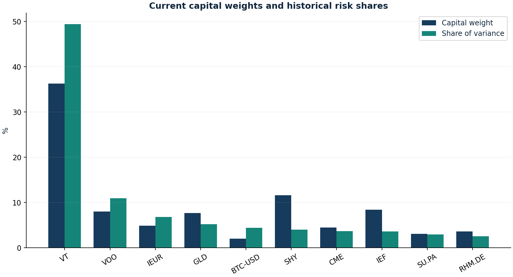

# Capital weights versus risk contributions

Research authored 2026-09-28 · Historical risk diagnostic

## Question

Which positions consume the portfolio's risk budget?

## Computed finding

Current weights on the pre-inception sample imply 13.19% annual volatility; daily 97.5% ES is 2.17%. The block-bootstrap volatility range is 11.87%–14.67%.



## Method

Apply current weights to EUR returns from 2021–2024. Use sample covariance as the transparent baseline and compare 0%, 25%, 50% and 100% shrinkage to constant-correlation and diagonal targets. Compute Euler variance shares, daily historical VaR/ES and a circular block-bootstrap volatility interval. Compare with a recent window.

## Investment implication

Small crypto or single-stock capital weights can consume disproportionate risk. Overlapping equity funds require a covariance view rather than a count of holdings.

## What could invalidate the interpretation

If risk rankings change substantially across windows or shrinkage assumptions, precise risk budgets deserve less confidence; no single covariance matrix is treated as truth.

## Next research step

Add verified fund look-through and stress correlations. Estimate shrinkage intensity before using this as an optimiser.

## Discussion prompt

Explain why an empirical ES based on 19 tail observations is fragile and why current weights on past returns are a scenario, not a historical live forecast.

## Limitations

Current weights on old returns are a historical stress lens, not a 2024 forecast. Ledoit-Wolf explicitly cautions against constant correlation across asset classes; it is shown only as a sensitivity target here. Diagonal shrinkage can also suppress real common risks. No optimal intensity is estimated. Sample covariance is noisy and bootstrap intervals omit unseen regimes.

## Reproduce

```bash
python -m investment_lab risk
```

Full numerical output: [risk.json](risk.json). CSV tables use decimal returns, not percentages.

## Sources and use

- [Ledoit & Wolf — Honey, I Shrunk the Sample Covariance Matrix (2003 working paper; 2004 publication)](https://econ-papers.upf.edu/papers/691.pdf): Structured estimation motivation. The paper cautions against constant correlation across asset classes; both constant-correlation and diagonal targets are sensitivity checks, not validated allocation models. No optimal intensity is estimated.
- [DeMiguel, Garlappi & Uppal — Optimal versus Naive Diversification (2009)](https://doi.org/10.1093/rfs/hhm075): Estimation error motivates simple benchmark rules; no replication of the paper and no endorsement of these exact weights.
- [Liu & Tsyvinski — Risks and Returns of Cryptocurrency (2018)](https://www.nber.org/papers/w24877): Motivates separate crypto risk treatment; an early sample does not establish stable modern correlations.
