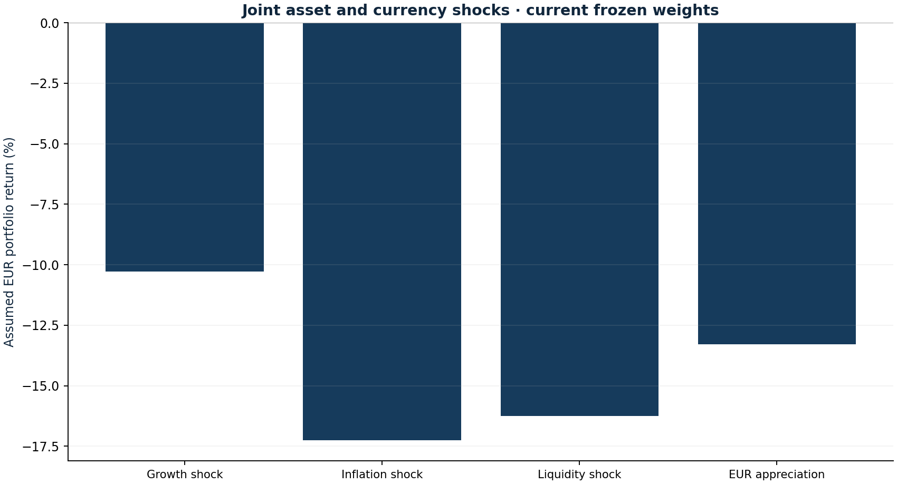

# Cross-asset stress laboratory

Research authored 2026-10-03 · Hypothetical joint shocks

## Question

What breaks when rates, equities, crypto and currencies move together?

## Computed finding

The assumed inflation shock produces -17.2% (-21,998 EUR) on the 25 September book. This is a scenario, not a probability or VaR estimate.



## Input dates and assumptions

- Weights and NAV: 25 September 2026; cash unchanged; no pending fill.
- USD shock means change in EUR per USD. Asset and FX effects compound, including the cross term.
- IEF/SHY durations 7.2/1.8 and convexities 60/4 are teaching assumptions, not current fund analytics.

## Method

Apply four explicit, hypothetical joint shocks to the 25 September holdings. Revalue local returns and EUR conversion with their interaction. Approximate IEF and SHY with assumed duration and convexity; reconcile holding-level impacts to total NAV.

## Investment implication

Use the largest losses to identify common exposures and specify an acceptable loss budget before considering any hedge.

## What could invalidate the interpretation

Different FX behaviour, convexity, correlations or liquidity can reverse the scenario ranking. Shock sizes are assumptions, not estimated percentiles.

## Next research step

Source dated ETF duration and curve data, add spread and liquidity shocks, and map fund economic currency exposures.

## Discussion prompt

Why can a positive USD move cushion losses for a EUR investor? Which cross term is lost by adding local and currency returns?

## Limitations

Stress severities are chosen assumptions. Applying a common listing-currency shock can double-count economic FX exposures embedded in global assets. Nonlinear rate approximation, no dynamic hedge, liquidity haircut, counterparty default, tax or future cash flows. This does not claim to reproduce a particular crisis or regulatory stress test.

## Reproduce

```bash
python -m investment_lab stress
```

Full numerical output: [stress.json](stress.json). CSV tables use decimal returns, not percentages.

## Sources and use

- [BCBS (2018), Stress testing principles](https://www.bis.org/bcbs/publ/d450.htm): Scenario design and governance motivation. The four assumed shocks are not a regulatory stress test or estimated crisis probabilities.
- [Frozen portfolio and Yahoo Finance price archives](https://fabio-investment-lab.fraccafabio.chatgpt.site/#method): Accounting inputs and reference closing marks. Retrieved in 2026, not historical point-in-time vintages.
