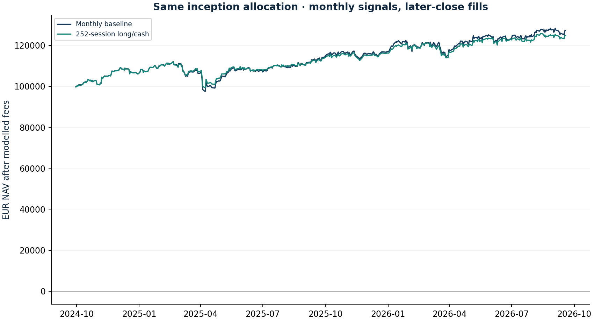

# Trend rule with delayed execution

Research authored 2026-10-03 · Retrospective policy experiment

## Question

Does a transparent long/cash trend rule change the portfolio’s loss profile?

## Computed finding

The stated 252-session long/cash rule returned 24.8% after costs versus 27.2% for the same allocation reset monthly. All nine lookback/cost cases are disclosed; none is selected as optimal.



## Input dates and assumptions

- Start 30 September 2024; fixed inception universe and weights; monthly last-calendar-weekday review.
- Positive trailing EUR adjusted return retains the initial asset budget; otherwise allocate it to zero-yield EUR cash. No shorts or leverage.
- Execution at the next common close. 25 bp per side, 50 bp for crypto. Asset exposure earns subsequent returns only. Missing review-day quote skips the review.

## Method

Use each instrument’s lagged 252-session EUR return to retain its original weight or move that sleeve to cash. Review monthly and fill only at the next available common close. Compare the same initial allocation without the signal; report all 126/189/252-session and cost sensitivities.

## Investment implication

Evaluate drawdown, cash drag, turnover and implementation together. Do not select a parameter because it maximises this short sample’s return.

## What could invalidate the interpretation

Whipsaws, slow re-entry, stale common dates and hindsight in selecting the universe can erase apparent protection.

## Next research step

Preregister one rule and cost assumption, then log forward signals without tuning on the new observations.

## Discussion prompt

Explain the distinction between a past-return signal, its later executable fill, and the published futures momentum literature.

## Limitations

Rules and assets were chosen in October 2026 with knowledge of the past; this is retrospective research despite chronological execution. Reversals and repeated crossings can cause whipsaw and tax costs. ETF long/cash rules differ from the paper’s diversified, volatility-scaled long/short futures. Common dates omit some markets’ sessions and crypto weekends.

## Reproduce

```bash
python -m investment_lab trend
```

Full numerical output: [trend.json](trend.json). CSV tables use decimal returns, not percentages.

## Sources and use

- [Moskowitz, Ooi & Pedersen (2012), Time Series Momentum](https://www.aqr.com/Insights/Research/Journal-Article/Time-Series-Momentum): Motivates lagged own-return signals. Our monthly long/cash ETF rule is not a replication of the paper’s futures strategy.
- [Frozen portfolio and Yahoo Finance price archives](https://fabio-investment-lab.fraccafabio.chatgpt.site/#method): Accounting inputs and reference closing marks. Retrieved in 2026, not historical point-in-time vintages.
