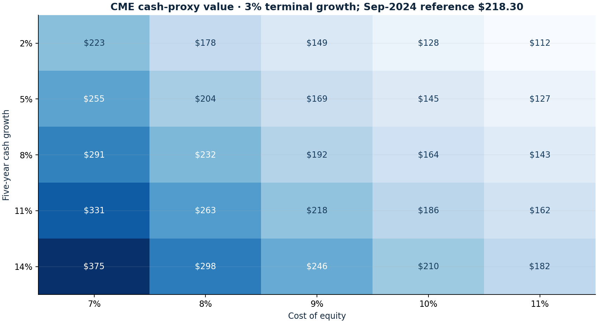

# CME reverse valuation

Research authored 2026-09-28 · Historical valuation sensitivity

## Question

How much cash-flow growth was embedded in the September-2024 price?

## Computed finding

The September-2024 CME price requires 11.04% annual cash growth under the stated discount assumptions. Base proxy value: $192.35; 77.1% comes from the terminal value.



## Method

Bridge FY2023 operating cash flow to a conservative per-share equity cash proxy, subtracting capex and stock compensation. Model five explicit years and a terminal value, solve implied growth, and show discount-rate/growth and bull/base/bear sensitivities.

## Investment implication

An attractive exchange franchise does not guarantee an attractive purchase price. A reverse valuation makes the growth hurdle visible and can challenge an optimistic narrative.

## What could invalidate the interpretation

A cash proxy that misses recurring reinvestment, financing or competitive pressure is insufficient. A high terminal-value share makes apparently precise fair values especially fragile.

## Next research step

Build a current operating forecast from volumes, revenue per contract, product mix, expenses, collateral economics and capital allocation.

## Discussion prompt

Explain why subtract SBC, why there is no extra net-cash add-on here, and why this aged inception model cannot justify a 2026 hold without refreshed inputs.

## Limitations

CFO less capex less SBC is a deliberately conservative proxy, not a full FCFE forecast. No financing forecast; participating securities added conservatively to denominator. No incremental net-cash add-on. September-2024 valuation exercise, not a current target or proof of a historical decision.

## Reproduce

```bash
python -m investment_lab valuation
```

Full numerical output: [valuation.json](valuation.json). CSV tables use decimal returns, not percentages.

## Sources and use

- [Damodaran — Free Cash Flow to Equity Discount Models, chapter 14](https://pages.stern.nyu.edu/~adamodar/pdfiles/valn2ed/ch14.pdf): Equity cash-flow discounting framework; the CME cash proxy omits a complete financing and operating forecast.
- [CME Group FY2023 Form 10-K](https://www.sec.gov/Archives/edgar/data/1156375/000115637524000010/cme-20231231.htm): Cash-flow statement: CFO $3,453.8m; property purchases $76.4m; SBC $82.9m. Share denominator is disclosed separately in the input notes.
