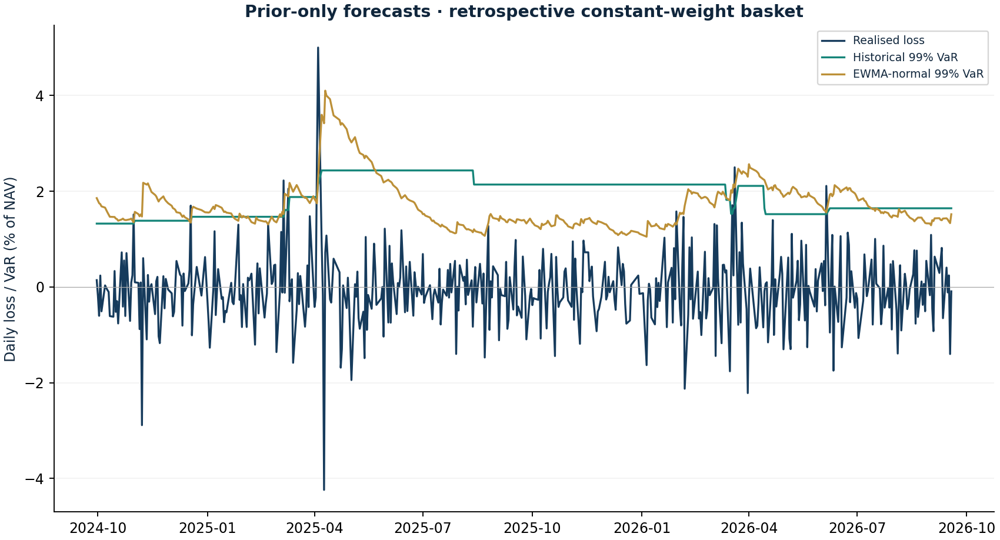

# VaR forecast coverage checks

Research authored 2026-10-03 · Educational backtest

## Question

Do simple daily loss forecasts produce the expected number of breaches?

## Computed finding

Rolling historical 99% VaR recorded 9 breaches in 484 evaluation sessions (expected 4.8). Coverage and clustering must be examined together.



## Input dates and assumptions

- Current frozen weights applied to common-session EUR returns; this is hypothetical P&L, not actual ledger P&L.
- Historical window 250; EWMA lambda 0.94, zero conditional mean, normal quantile. Seed uses the first 60 returns; scoring starts after 250.
- Kupiec unconditional-coverage LR uses an asymptotic chi-square(1) reference; Wilson intervals show count uncertainty. Adjacent pairs are descriptive only.

## Method

Create lagged 250-session historical and exponentially weighted Gaussian risk forecasts at 95% and 99%. Count later exceedances, show Wilson coverage intervals, Kupiec unconditional-coverage likelihood ratios and descriptive adjacent-breach counts.

## Investment implication

Check both frequency and clustering before relying on a risk number. A model that passes a small-sample coverage check can still miss crisis losses.

## What could invalidate the interpretation

The fixed current-weight proxy is hindsight-based. Gaussian tails, sparse 99% exceptions and asymptotic p-values limit inference; clustering is not formally tested here.

## Next research step

Maintain a prospective ledger of forecasts and realised hypothetical P&L; add independent clustering and tail-severity tests.

## Discussion prompt

Why does unconditional coverage fail to detect clustered breaches? Explain the zero-exception edge case.

## Limitations

Neither model certifies tail protection. Small breach counts make asymptotic p-values fragile; no conditional-independence test or regulatory approval is claimed. Model selection is retrospective, observations are dependent and realised P&L is constructed with later weights. Do not use a passed coverage check as proof of a sound expected-shortfall model.

## Reproduce

```bash
python -m investment_lab varchecks
```

Full numerical output: [varchecks.json](varchecks.json). CSV tables use decimal returns, not percentages.

## Sources and use

- [Basel Framework MAR32, Backtesting requirements](https://www.bis.org/committees/bcbs/basel-framework/standard/mar/32/inforce/2023-01-01/published/2020-03-27): Motivates comparison of lagged risk forecasts with subsequent losses. Coverage diagnostics here are educational, not a regulatory backtest or model certification.
- [Frozen portfolio and Yahoo Finance price archives](https://fabio-investment-lab.fraccafabio.chatgpt.site/#method): Accounting inputs and reference closing marks. Retrieved in 2026, not historical point-in-time vintages.
