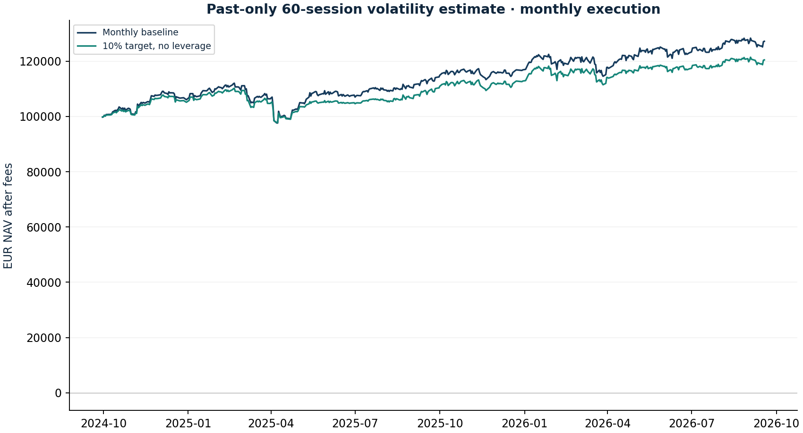

# Cash-funded volatility targeting

Research authored 2026-10-03 · Capped exposure experiment

## Question

What does reducing exposure after volatility rises cost and protect?

## Computed finding

The 10% target rule realised 10.6% volatility and -11.3% maximum drawdown versus 12.6% and -12.9% for the monthly baseline. A target is not a risk guarantee.



## Input dates and assumptions

- Scale = clip(target / trailing 60-common-session basket volatility, 0.25, 1.00).
- Targets 8%, 10%, 12% are all reported. Cash earns zero; no leverage, no forecast of expected return.
- Signal/fill convention and costs are identical to the trend project; baseline uses the same monthly reset.

## Method

Estimate 60-session realised EUR basket volatility using only available closes. Scale original risky targets by target-volatility/estimated-volatility, clipped to 25–100%; review monthly and fill later. Compare 8%, 10%, 12% targets and zero/base/double transaction costs.

## Investment implication

Treat exposure control as a risk policy with cash drag and turnover. A target is an estimator input, not a guaranteed realised volatility.

## What could invalidate the interpretation

Gaps can occur before risk is reduced; rapid recoveries can punish delayed re-entry. The policy cannot lever up when the portfolio is below target.

## Next research step

Specify a prospective volatility band, review cadence and financing assumptions before comparing realised forward risk.

## Discussion prompt

Why is inverse volatility not inverse variance? Why does no leverage make a low-volatility regime asymmetric?

## Limitations

A monthly rule can react late to volatility spikes and miss rebounds after selling. The scaled basket is not the paper’s inverse-variance factor strategy. Lower risk can reflect simply holding more cash. No risk-matched alpha claim, cash interest, tax, liquidity feedback or intraday execution model.

## Reproduce

```bash
python -m investment_lab volcontrol
```

Full numerical output: [volcontrol.json](volcontrol.json). CSV tables use decimal returns, not percentages.

## Sources and use

- [Moreira & Muir (2016/2017), Volatility-Managed Portfolios](https://www.nber.org/papers/w22208): Motivates exposure sensitivity to realised volatility. Our capped volatility target differs from the paper’s inverse-variance factor portfolios.
- [Frozen portfolio and Yahoo Finance price archives](https://fabio-investment-lab.fraccafabio.chatgpt.site/#method): Accounting inputs and reference closing marks. Retrieved in 2026, not historical point-in-time vintages.
